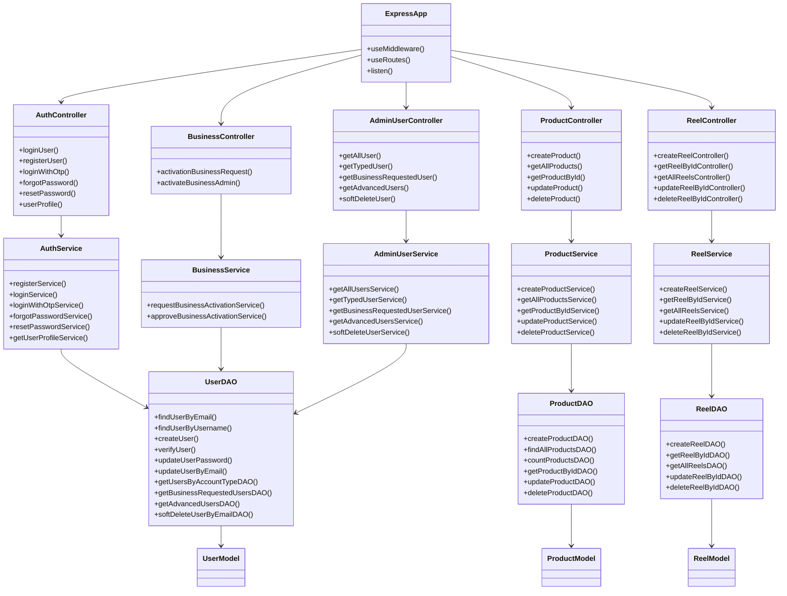

```mermaid
classDiagram
    class ExpressApp {
      +useMiddleware()
      +useRoutes()
      +listen()
    }

    class AuthController {
      +loginUser()
      +registerUser()
      +loginWithOtp()
      +forgotPassword()
      +resetPassword()
      +userProfile()
    }

    class BusinessController {
      +activationBusinessRequest()
      +activateBusinessAdmin()
    }

    class ProductController {
      +createProduct()
      +getAllProducts()
      +getProductById()
      +updateProduct()
      +deleteProduct()
    }

    class ReelController {
      +createReelController()
      +getReelByIdController()
      +getAllReelsController()
      +updateReelByIdController()
      +deleteReelByIdController()
    }

    class AdminUserController {
      +getAllUser()
      +getTypedUser()
      +getBusinessRequestedUser()
      +getAdvancedUsers()
      +softDeleteUser()
    }

    class AuthService {
      +registerService()
      +loginService()
      +loginWithOtpService()
      +forgotPasswordService()
      +resetPasswordService()
      +getUserProfileService()
    }

    class BusinessService {
      +requestBusinessActivationService()
      +approveBusinessActivationService()
    }

    class ProductService {
      +createProductService()
      +getAllProductsService()
      +getProductByIdService()
      +updateProductService()
      +deleteProductService()
    }

    class ReelService {
      +createReelService()
      +getReelByIdService()
      +getAllReelsService()
      +updateReelByIdService()
      +deleteReelByIdService()
    }

    class AdminUserService {
      +getAllUsersService()
      +getTypedUserService()
      +getBusinessRequestedUserService()
      +getAdvancedUsersService()
      +softDeleteUserService()
    }

    class UserDAO {
      +findUserByEmail()
      +findUserByUsername()
      +createUser()
      +verifyUser()
      +updateUserPassword()
      +updateUserByEmail()
      +getUsersByAccountTypeDAO()
      +getBusinessRequestedUsersDAO()
      +getAdvancedUsersDAO()
      +softDeleteUserByEmailDAO()
    }

    class ProductDAO {
      +createProductDAO()
      +findAllProductsDAO()
      +countProductsDAO()
      +getProductByIdDAO()
      +updateProductDAO()
      +deleteProductDAO()
    }

    class ReelDAO {
      +createReelDAO()
      +getReelByIdDAO()
      +getAllReelsDAO()
      +updateReelByIdDAO()
      +deleteReelByIdDAO()
    }

    class UserModel
    class ProductModel
    class ReelModel

    AuthController --> AuthService
    BusinessController --> BusinessService
    ProductController --> ProductService
    ReelController --> ReelService
    AdminUserController --> AdminUserService

    AuthService --> UserDAO
    BusinessService --> UserDAO
    AdminUserService --> UserDAO
    ProductService --> ProductDAO
    ReelService --> ReelDAO

    UserDAO --> UserModel
    ProductDAO --> ProductModel
    ReelDAO --> ReelModel

    ExpressApp --> AuthController
    ExpressApp --> BusinessController
    ExpressApp --> ProductController
    ExpressApp --> ReelController
    ExpressApp --> AdminUserController
```