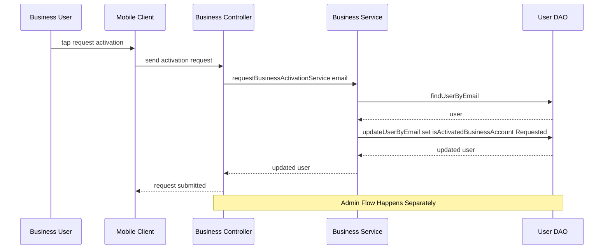

```mermaid
   sequenceDiagram
    participant BusinessUser as Business User
    participant Mobile as Mobile Client
    participant BusinessController as Business Controller
    participant BusinessService as Business Service
    participant UserDAO as User DAO

    BusinessUser->>Mobile: tap request activation
    Mobile->>BusinessController: send activation request
    BusinessController->>BusinessService: requestBusinessActivationService email
    BusinessService->>UserDAO: findUserByEmail
    UserDAO-->>BusinessService: user
    BusinessService->>UserDAO: updateUserByEmail set isActivatedBusinessAccount Requested
    UserDAO-->>BusinessService: updated user
    BusinessService-->>BusinessController: updated user
    BusinessController-->>Mobile: request submitted

    Note over BusinessController,UserDAO: Admin Flow Happens Separately

```