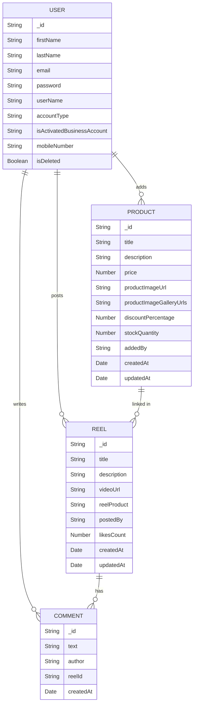

```mermaid
erDiagram
    USER {
        String _id
        String firstName
        String lastName
        String email
        String password
        String userName
        String accountType
        String isActivatedBusinessAccount
        String mobileNumber
        Boolean isDeleted
    }

    PRODUCT {
        String _id
        String title
        String description
        Number price
        String productImageUrl
        String productImageGalleryUrls
        Number discountPercentage
        Number stockQuantity
        String addedBy
        Date createdAt
        Date updatedAt
    }

    REEL {
        String _id
        String title
        String description
        String videoUrl
        String reelProduct
        String postedBy
        Number likesCount
        Date createdAt
        Date updatedAt
    }

    COMMENT {
        String _id
        String text
        String author
        String reelId
        Date createdAt
    }

    USER ||--o{ PRODUCT : "adds"
    USER ||--o{ REEL : "posts"
    PRODUCT ||--o{ REEL : "linked in"
    USER ||--o{ COMMENT : "writes"
    REEL ||--o{ COMMENT : "has"
```