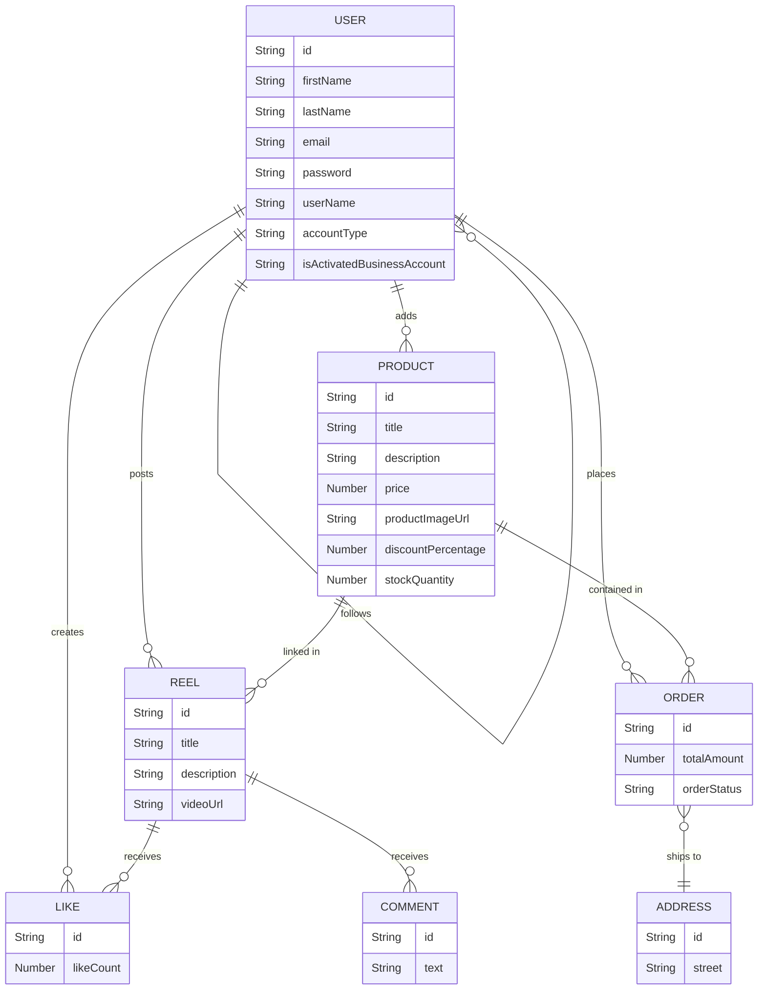

```mermaid
erDiagram
    USER ||--o{ PRODUCT : "adds"
    USER ||--o{ REEL : "posts"
    USER ||--o{ LIKE : "creates"
    USER ||--o{ ORDER : "places"
    USER ||--o{ USER : "follows"

    PRODUCT ||--o{ REEL : "linked in"
    PRODUCT ||--o{ ORDER : "contained in"

    REEL ||--o{ LIKE : "receives"
    REEL ||--o{ COMMENT : "receives"
    ORDER }o--|| ADDRESS : "ships to"

    USER {
        String id
        String firstName
        String lastName
        String email
        String password
        String userName
        String accountType
        String isActivatedBusinessAccount
    }

    PRODUCT {
        String id
        String title
        String description
        Number price
        String productImageUrl
        Number discountPercentage
        Number stockQuantity
    }


    REEL {
    String id
        String title
        String description
        String videoUrl
    }

    LIKE {
        String id
        Number likeCount
    }

    ORDER {
        String id
        Number totalAmount
        String orderStatus
    }

    COMMENT {
        String id
        String text
    }


    ADDRESS {
        String id
        String street
    }
```