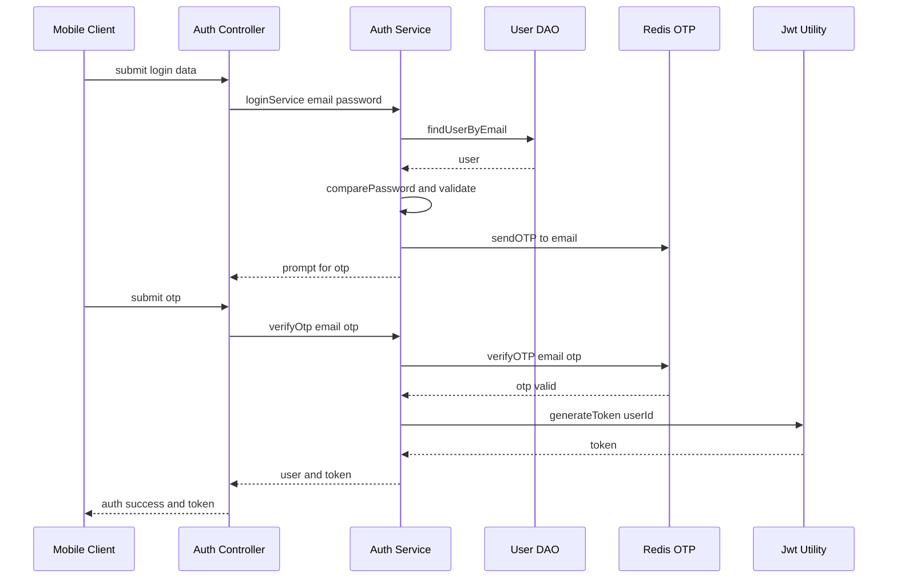

```mermaid
sequenceDiagram
    participant Mobile as Mobile Client
    participant AuthController as Auth Controller
    participant AuthService as Auth Service
    participant UserDAO as User DAO
    participant Redis as Redis OTP
    participant Jwt as Jwt Utility

    Mobile->>AuthController: submit login data
    AuthController->>AuthService: loginService email password
    AuthService->>UserDAO: findUserByEmail
    UserDAO-->>AuthService: user
    AuthService->>AuthService: comparePassword and validate
    AuthService->>Redis: sendOTP to email
    AuthService-->>AuthController: prompt for otp
    Mobile->>AuthController: submit otp
    AuthController->>AuthService: verifyOtp email otp
    AuthService->>Redis: verifyOTP email otp
    Redis-->>AuthService: otp valid
    AuthService->>Jwt: generateToken userId
    Jwt-->>AuthService: token
    AuthService-->>AuthController: user and token
    AuthController-->>Mobile: auth success and token
```