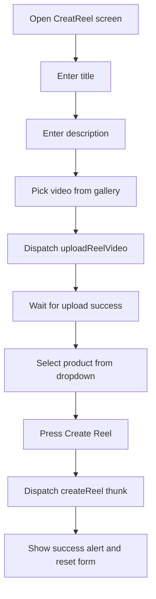

```mermaid
flowchart TD
    Start[Open CreatReel screen] --> EnterTitle[Enter title]
    EnterTitle --> EnterDescription[Enter description]
    EnterDescription --> PickVideo[Pick video from gallery]
    PickVideo --> UploadVideo[Dispatch uploadReelVideo]
    UploadVideo --> WaitUpload[Wait for upload success]
    WaitUpload --> SelectProduct[Select product from dropdown]
    SelectProduct --> SubmitReel[Press Create Reel]
    SubmitReel --> DispatchCreate[Dispatch createReel thunk]
    DispatchCreate --> Success[Show success alert and reset form]
```