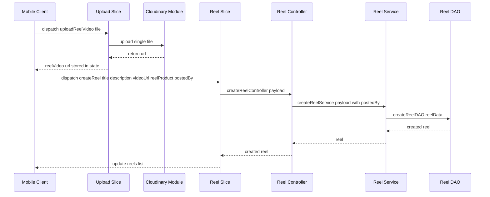

```mermaid
    sequenceDiagram
    participant Mobile as Mobile Client
    participant UploadSlice as Upload Slice
    participant CloudinaryModule as Cloudinary Module
    participant ReelSlice as Reel Slice
    participant ReelController as Reel Controller
    participant ReelService as Reel Service
    participant ReelDAO as Reel DAO

    Mobile->>UploadSlice: dispatch uploadReelVideo file
    UploadSlice->>CloudinaryModule: upload single file
    CloudinaryModule-->>UploadSlice: return url
    UploadSlice-->>Mobile: reelVideo url stored in state

    Mobile->>ReelSlice: dispatch createReel title description videoUrl reelProduct postedBy
    ReelSlice->>ReelController: createReelController payload
    ReelController->>ReelService: createReelService payload with postedBy
    ReelService->>ReelDAO: createReelDAO reelData
    ReelDAO-->>ReelService: created reel
    ReelService-->>ReelController: reel
    ReelController-->>ReelSlice: created reel
    ReelSlice-->>Mobile: update reels list
```