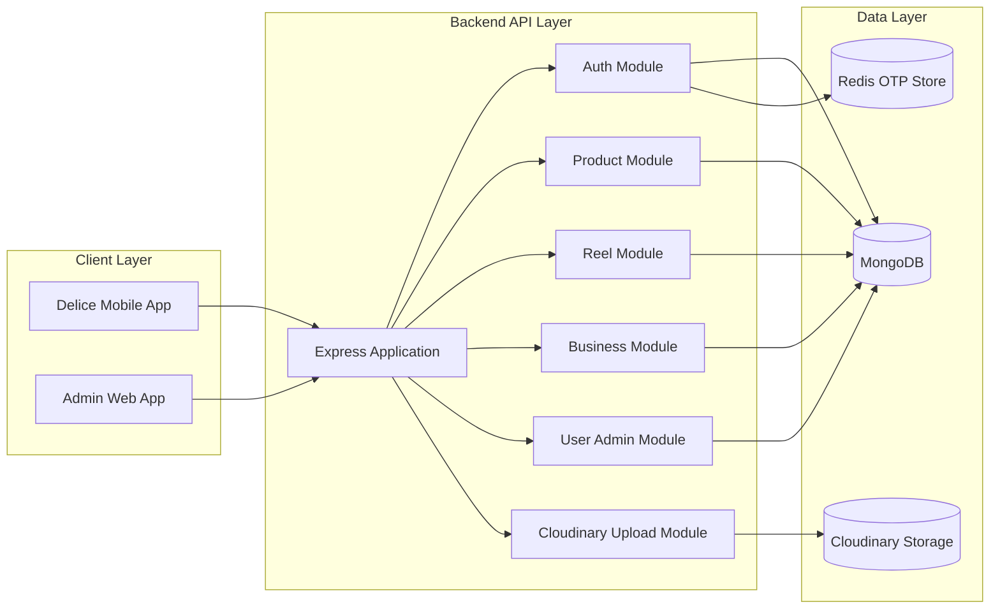

```mermaid
flowchart LR
    subgraph ClientLayer [Client Layer]
        MobileApp[Delice Mobile App]
        AdminApp[Admin Web App]
    end

    subgraph BackendLayer [Backend API Layer]
        ExpressApp[Express Application]
        AuthModule[Auth Module]
        ProductModule[Product Module]
        ReelModule[Reel Module]
        BusinessModule[Business Module]
        UserAdminModule[User Admin Module]
        CloudinaryModule[Cloudinary Upload Module]
    end

    subgraph DataLayer [Data Layer]
        MongoDB[(MongoDB)]
        Cloudinary[(Cloudinary Storage)]
        Redis[(Redis OTP Store)]
    end

    MobileApp --> ExpressApp
    AdminApp --> ExpressApp

    ExpressApp --> AuthModule
    ExpressApp --> ProductModule
    ExpressApp --> ReelModule
    ExpressApp --> BusinessModule
    ExpressApp --> UserAdminModule
    ExpressApp --> CloudinaryModule

    AuthModule --> MongoDB
    ProductModule --> MongoDB
    ReelModule --> MongoDB
    BusinessModule --> MongoDB
    UserAdminModule --> MongoDB

    CloudinaryModule --> Cloudinary
    AuthModule --> Redis
```